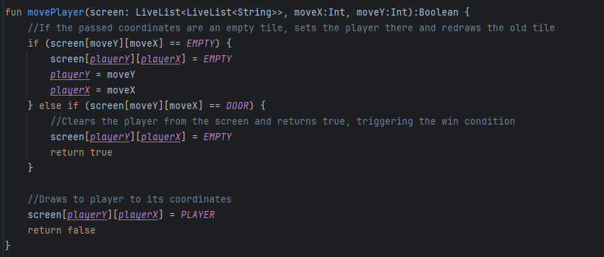
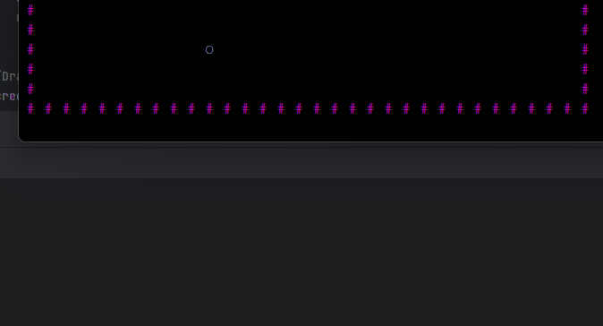
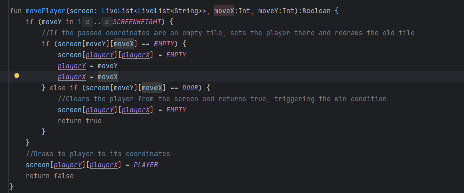
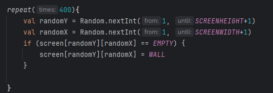
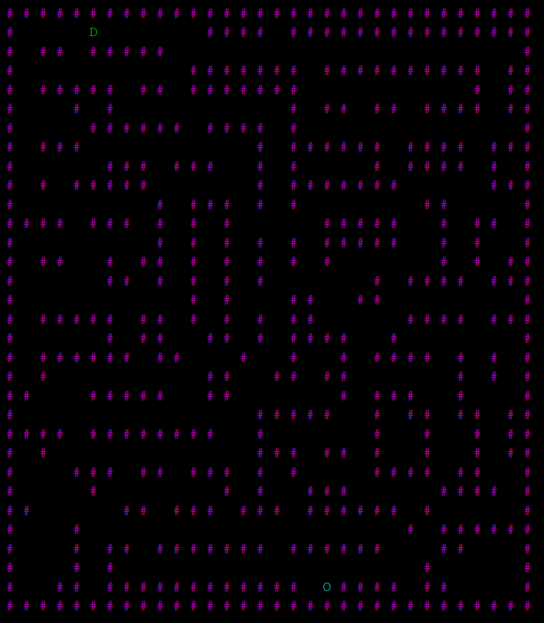
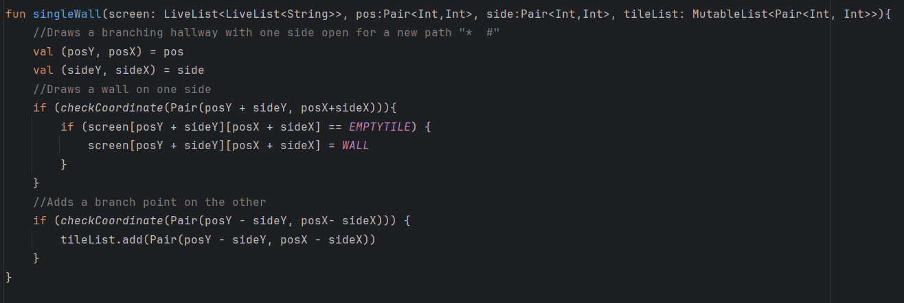
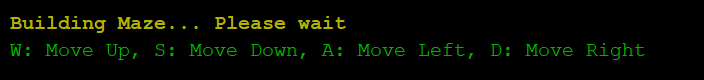
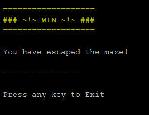

# Development Log

The development log captures key moments in your application development:

- **Design ideas / notes** for features, UI, etc.
- **Key features** completed and working
- **Interesting bugs** and how you overcame them
- **Significant changes** to your design
- Etc.

---

## Date: 25/03/2025

### Movement Boundary Error
If the player is at the top most row and tries to move up, or the bottom most row and tries to move down, the boundary wall that is there to stop the player it's checked for an index to see if it is a wall or not, but as it is a single index the game crashes.

Old Code and error:

Fixed Code\
I added a check to see if the index was valid before attempting to even move to prevent any out of bounds errors from occuring due to player movement.

---

## Date: 27/03/2025

### Maze Generation
I currently have a simple maze generation script to place walls randomly inside the play area, this system does not work well as it was not always winnable, with the door and player being able to spawn in closed off areas.

I need to rewrite this code to procedurally generate a maze that can be navigated.

---

## Date: 7/04/2025
I rewrote the function for generating the maze, it now creates corridors with branching paths and **should** be solveable every time.
This new system looks and acts how a real maze should and the generation system used for it is based off the 'recursive backtracker' algorithm used in maze generation, it is not perfect, and sometimes creates small pockets that cannot be accessed, but it it rare.

---

## Date: 4/04/2025

Fixed an error that was causing branches to be generated on the border wall, allowing the player to move out of bounds, and moving to an invalid index of the screens 2D array.

I added more checking to the wall generation on the Branches, to stop this from occuring, keeping the player restrained to valid indexes.

---

## Date: 7/04/2025

Added a start screen to the terminal, so that it gives the user feedback on what is occuring in the program. Otherwise it would be producing a blank screen, that would make users confused and think the program doesn't work. The loading screen also has the controls so the user knows how to play the game.

Also added a win condition at the end of the game.

---

