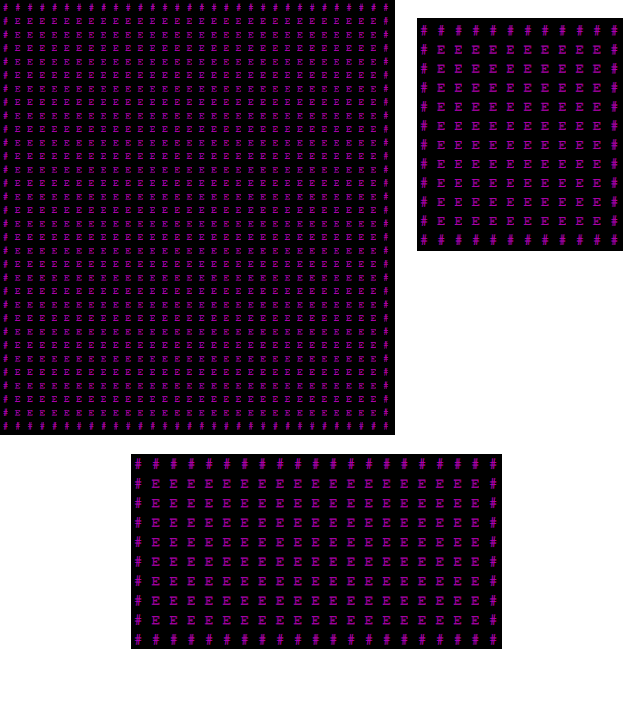
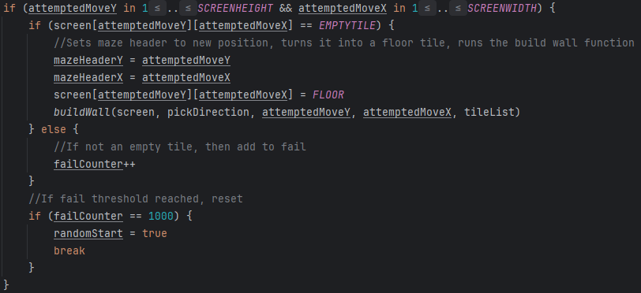
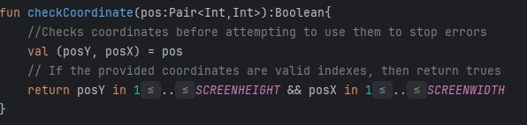
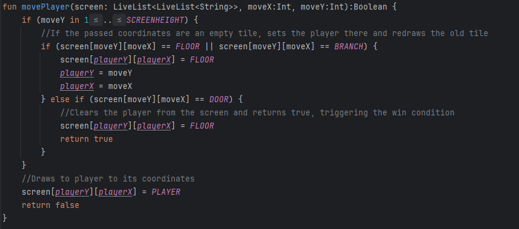
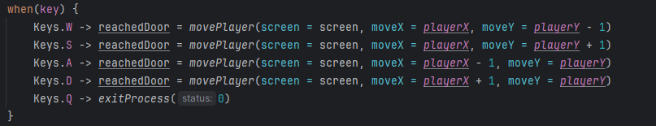

# Results of Testing

The test results show the actual outcome of the testing, following the [Test Plan](test-plan.md)

---

## Screen building

I tested the screen setup in the beginning of the script, to see if it dynamically creates a screen at the correct resolution, with it being a 2D array so I can easily access and edit any part of the screen. I tried different values for the screen size constants (SCREENHEIGHT, SCREENWIDTH) to see if it worked at any size without errors or invalid indexes

### Test Data Used

Running the setup for the game multiple times to see how it handles different sizes, resolutions and shapes.

### Test Result

Different maze sizes ^

Changing the maze size did not break the screen, with it always generating correctly at the set resolution. Having rectangles instead of squares also worked, and there was no generation out of bounds, with it only building inside the 2D array of the screen. The border wall it generates around the outside also worked well at any size. Each character has a Y and X index, allowing them to be easily referenced or replaced.

---

## Maze Generation Testing

I tested the maze generation to see the reliability of my system for procedurally generating a maze that the player can navigate and reach the end.

To do this test I ran my game 10 times to see how well the maze generation algorithm worked.

### Test Data Used

Running the game 10 times to see how it generates the maze and how well it does so.

### Test Result

Out of the 10 times I ran the script, the program was solveable every time, and the generation created a recognisable maze for what we would expect from a square maze. The image above shows a generation with quite a few of the unreachable pockets however they are not stopping the player from winning and are just acting as large walls.

The maze is all generating within the bounds of the screens 2D array, it never throws an invalid bounds error as the program is set up to check the indexes its trying to use before trying to actually reference them, stopping issues from occuring and keeping the maze generation within the valid bounds of the screen.

While doing other testing I got a generation where the player was trapped in a pocket, and running the script a few more times resulted with working generations. This means that while it is possible to happen it is rare.

---

## Boundary Testing

I tested how my program handles the boundaries of the screen 2D array on which the game takes place.

## Test Data Used

Running the program multiple times and trying to move the player out of bounds in different ways, trying this on all 4 of the boundaries.

## Test Result

The maze generation never threw errors when generating around boundaries of the screen, which means that it does not try to generate outside the screen.

This is the part of my maze generation code that determines where it will attempt to build next, it checks if the attempted build location is valid and is in the bounds of the screen before trying to build there, stopping it from generating out of bounds. If the attempted move is invalid or is already a generated tile, it will add to a fail counter and attempt a different move, it it fails a certain amount then it will teleport to a new empty tile and try again.

This is another function that is used a lot for checking if the coordinates given are valid and in bounds of the screen. It is called to check before attempting to use the coordinates, which stops out of bounds errors being thrown.

I tried moving the player out of bounds on all 4 boundary walls, and none of them threw an error meaning it is handling the boundaries correctly.

It uses a similar system of checking the coordinates before moving there to stop invalid moves that would crash the game.

---

## Input Error Checking

I tested how my program handled bad user inputs and invalid actions.

## Test Data Used

Trying to enter inputs that are not parts of the game, and try to do invalid actions like moving through walls to see how it is handled.

## Test Result

Entering random keys had no impact on my game, throwing no errors. The input system only checks for inputs that have been set, so entering other inputs will not cause an error and will be ignored. 

This is the part of my program which handles user input, as it is only checking fot those 5 Keys, any other input will be ignored and will not Cause errors.

Making invalid actions also is handled well, not allowing users to move through walls.

The player movement function checks if the tile type of the attempted move is a floor or branch tile, which can be stood on. If it is not the movement action will not be taken, preventing bad moves.

---

## Reaching Door (Win Condition)

I tested the win condition of the game, which triggers when the player reaches the exit door.

### Test Data Used

I beat the game multiple times to ensure that the win condition always triggers correctly.

### Test Result

The door always generates, and the player touching it causes the game loop to end, the make is wiped and then the win condition is triggered, which runs an animation until the player enters any input to close the game.

---
