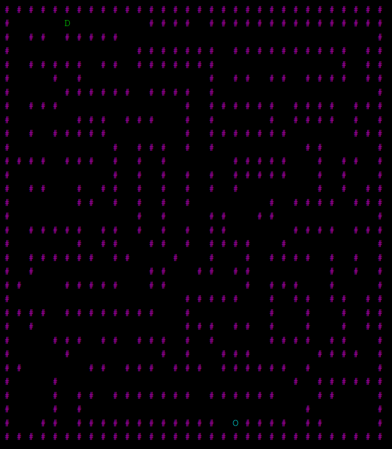

# Results of Testing

The test results show the actual outcome of the testing, following the [Test Plan](test-plan.md)

---

## Screen building

I tested the screen setup in the beginning of the script, to see if it dynamically creates a screen at the correct resolution, with it being a 2D array so I can easily access and edit any part of the screen. I tried different values for the screen size constants (SCREENHEIGHT, SCREENWIDTH) to see if it worked at any size without errors or invalid indexes

### Test Data Used

The data I am using is the Constants for the screen size, SCREENHEIGHT and SCREENWIDTH, these will determine the resolution of the screen. A 2D array with of the actual screen will be used as well to actually build the play area in. The screen setup function needs to be run to build the screen.

### Test Result

Different maze sizes ^

Changing the maze size did not break the screen, with it always generating correctly at the set resolution. Having rectangles instead of squares also worked, and there was no generation out of bounds, with it only building inside the 2D array of the screen. The border wall it generates around the outside also worked well at any size. Each character has a Y and X index, allowing them to be easily referenced or replaced.

---

## Maze Generation Testing

I tested the maze generation to see the reliability of my system for procedurally generating a maze that the player can navigate and reach the end.

To do this test I ran my game 10 times to see how well the maze generation algorithm worked.

### Test Data Used

The data I am using for this will be the Maze generation function, along with the other functions it uses within. The 2D array variable for the Screen will be used, with the walls and floors needing to be generated in the bounds of this array. Most parts of the script are at least referenced or need to be run to build the maze, excluding on things like player movement and the win conditions.

### Test Result

Out of the 10 times I ran the script, the program was solveable every time, and the generation created a recognisable maze for what we would expect from a square maze. The image above shows a generation with quite a few of the unreachable pockets however they are not stopping the player from winning and are just acting as large walls.

The maze is all generating within the bounds of the screens 2D array, it never throws an invalid bounds error as the program is set up to check the indexes its trying to use before trying to actually reference them, stopping issues from occuring and keeping the maze generation within the valid bounds of the screen.

While doing other testing I got a generation where the player was trapped in a pocket, and running the scripta few more times resulted with working generations. This means that while it is possible to happen it is rare.

---

## Example Test Name

Example test description. Example test description.Example test description. Example test description.Example test description. Example test description.

### Test Data Used

Details of test data. Details of test data. Details of test data. Details of test data. Details of test data. Details of test data. Details of test data.

### Test Result

Comment on test result. Comment on test result. Comment on test result. Comment on test result. Comment on test result. Comment on test result.

---

